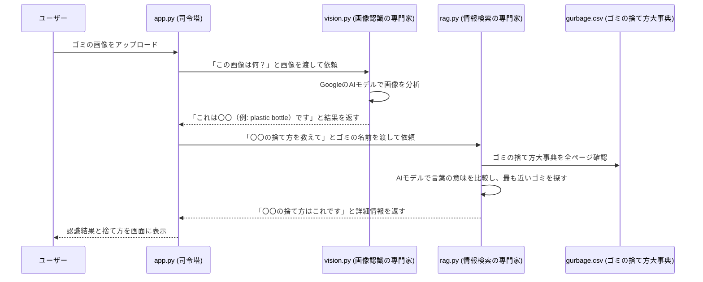

# Paderborn Waste Classifier

## 概要

このアプリケーションは、「**AIを使った賢いゴミ分別アシスタント**」です。

スマートフォンのカメラでゴミの写真を撮ってアップロードすると、AIがその画像を分析して「これは何だろう？」と判断します。次に、その判断結果をもとに、パーダーボルン市（Paderborn）のルールに従った正しいゴミの捨て方を調べて、画面に表示してくれます。

つまり、ユーザーは「このゴミ、どうやって捨てるんだっけ？」と悩んだときに、写真を撮るだけで簡単に答えを知ることができる、便利なツールです。

## アプリケーションの起動方法

1.  必要なライブラリをインストールします。
    ```bash
    pip install -r requirements.txt
    ```

2.  Streamlitアプリケーションを実行します。
    ```bash
    streamlit run app.py
    ```

## 詳細な流れ

ユーザーが画像をアップロードしてから、捨て方が表示されるまでの舞台裏は以下のようになっています。



1.  **画像のアップロード**: ユーザーがブラウザの画面でゴミの画像を選びます。
2.  **画像認識の依頼**: `app.py` が画像を受け取り、`vision.py` に「この画像が何か判断して」と依頼します。
3.  **AIによる画像分析**: `vision.py` は、Googleが開発した画像認識AI（Vision Transformer）を使い、画像に写っているものが何かを予測します。（例：「plastic bottle」）
4.  **情報検索の依頼**: `app.py` は、画像認識の結果（「plastic bottle」）を、今度は `rag.py` に渡し、「このゴミの捨て方を調べて」と依頼します。
5.  **意味で検索**: `rag.py` は、`gurbage.csv` というゴミの捨て方リストの中から、渡されたゴミの名前に**意味が最も近いもの**を探します。例えば、画像認識が「bottle」とだけ返しても、CSV内の「plastic bottle」を見つけ出すことができます。
6.  **結果の表示**: `rag.py` が見つけた捨て方の詳細情報を `app.py` に返し、`app.py` がそれをユーザーが見やすいように整形して画面に表示します。

## 各ファイルの役割

このアプリケーションは、役割分担されたいくつかのファイルで構成されています。

-   `app.py`
    -   **内容**: アプリケーションの見た目（UI）を作り、ユーザーからの操作（画像のアップロードなど）を受け付けます。他の専門家ファイル（`vision.py`や`rag.py`）に仕事を依頼し、最終的に受け取った結果を画面に表示する、全体の流れを管理するファイルです。

-   `vision.py`
    -   **内容**: 渡された画像データを分析し、それが何のゴミであるかを特定することだけに特化したファイルです。Googleの高性能な学習済みAIモデルを利用しています。

-   `rag.py`
    -   **内容**: ゴミの名前を受け取り、`gurbage.csv` の中から最も関連性の高いゴミの捨て方情報を見つけ出すことに特化したファイルです。単語の完全一致ではなく、意味の近さで検索する賢い検索エンジンを内蔵しています。

-   `gurbage.csv`
    -   **内容**: ゴミの品目（`clip_label`）、その捨て方（`paderborn_disposal`）、そして補足情報（`notes`）がリスト形式で保存されているデータファイルです。このファイルに情報を追加・修正することで、アプリが提供する情報を更新できます。

-   `requirements.txt`
    -   **内容**: このアプリケーションを動かすために必要な外部のライブラリ（便利なプログラム部品）の名前がリストアップされています。
